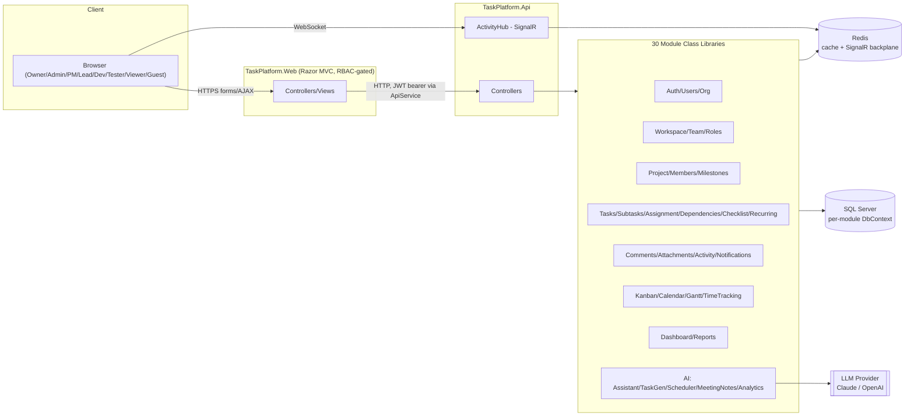

# Architecture

## 1. Summary

TaskPlatform is a multi-tenant, organization-wide project and task management platform (Jira/Asana-class) with a built-in AI assistant layer. It is built as an **ASP.NET Core 8 modular monolith** — the same architectural family as this workspace's other product, Sawi, but adapted to this product's shape: Sawi ships one separate deployable web app per actor type (Admin, Clinic, Doctor, Patient, ...) because those actors never share a screen. TaskPlatform's actors (Owner, Admin, PM, Team Lead, Developer, Tester, Viewer, Guest) constantly share the same boards, projects, and real-time activity feeds, so it is **one web application with role-based access control**, not one app per role. See [design-decisions.md](design-decisions.md) ADR-001 for the reasoning.

## 2. Pattern: Modular Monolith, Clean Architecture per module

Each of the specification's 30 modules (see [domain-model.md](domain-model.md)) is its own class library, internally structured as Clean Architecture layers — this exactly mirrors how `Users`, `Doctors`, `Payments`, etc. are structured in Sawi today:

```
Modules/<ModuleName>/
├── Domain/
│   ├── Entities/          # POCOs, no EF/framework dependency
│   └── IServices/         # service interfaces the module exposes
├── Application/
│   ├── Services/          # business logic implementing IServices
│   ├── Profiles/          # AutoMapper profiles (entity <-> ViewModel)
│   └── Extensions/        # DI registration (AddXModule(this IServiceCollection))
└── Infrastructure/
    ├── Context/           # the module's own EF Core DbContext
    └── Repositories/      # EF Core repository implementations
```

A monolith at the deployment boundary, modular at the code boundary — one process to run and deploy, but module code never reaches into another module's `Infrastructure` or `Domain.Entities` directly. Cross-module calls go through the other module's `IServices` interface, injected via DI. This gives most of the benefit of microservices (clear ownership boundaries, ability to extract a module into its own service later) without the operational cost a 10-week, largely-solo build cannot absorb.

## 3. Process / project map

```
TaskPlatform.sln
├── Modules/                        30 class libraries, one per spec module (see domain-model.md)
│   ├── Authentication/  UserManagement/  Organizations/          (Phase 1)
│   ├── Workspaces/  Teams/  RolesPermissions/                    (Phase 2)
│   ├── Projects/  ProjectMembers/  Milestones/                   (Phase 3)
│   ├── Tasks/  Subtasks/  TaskAssignment/  Dependencies/
│   │   Checklists/  RecurringTasks/                              (Phase 4)
│   ├── Comments/  Attachments/  ActivityTimeline/  Notifications/(Phase 5)
│   ├── Kanban/  Calendar/  GanttChart/  TimeTracking/            (Phase 6)
│   ├── Dashboard/  Reports/                                      (Phase 7)
│   └── AIAssistant/  AITaskGenerator/  AISmartScheduler/
│       AIMeetingNotes/  AIAnalytics/                              (Phase 8)
├── TaskPlatform.Api/                REST API host — Controllers reference every module's IServices
├── TaskPlatform.Web/                Single Razor MVC app, all 8 roles, RBAC-gated views/menus
├── TaskPlatform.Shared/             Cross-cutting helper lib (mirrors Sawi.Helper) — ApiService,
│                                    ViewModels/DTOs, Enums, Constants, Attributes, Exceptions
└── TaskPlatform.Tests/              xUnit — unit + integration tests, one folder per module
```

`TaskPlatform.Api` is the only project every module is wired into. `TaskPlatform.Web` never references a module directly — it talks to `TaskPlatform.Api` over HTTP through `TaskPlatform.Shared`'s `ApiService`, the same Web→API-over-HTTP shape Sawi's `Sawi.Admin`/`Sawi.Clinic` already use against `Sawi.API`. See ADR-002 in [design-decisions.md](design-decisions.md) for why that indirection is kept even though there is only one frontend this time.

## 4. Request flow (typical write)

```
Browser (Kanban drag, comment post, task create)
   │  AJAX / form POST
   ▼
TaskPlatform.Web  Controller
   │  ApiService.PostAsync<T>(...)  — attaches JWT bearer token held in the user's auth cookie's claims
   ▼
TaskPlatform.Api  Controller  — [Authorize], role/permission-checked via RoleClaimAuthorizeFilter
   │  calls ITasksService (Application layer of the Tasks module)
   ▼
TasksService — business rules (see business-rules.md), raises domain event (e.g. TaskAssigned)
   │
   ├──▶ TasksDbContext.SaveChanges()                     (Infrastructure)
   ├──▶ IActivityTimelineService.Log(...)                  cross-module call via interface
   ├──▶ INotificationService.NotifyAsync(...)  → SignalR hub + email/in-app row
   └──▶ (if AI feature involved) IAIAssistantService / IAISmartSchedulerService
```

Cross-module calls (Tasks → ActivityTimeline, Tasks → Notifications) are synchronous in-process calls through injected interfaces for phase 1–7 modules. This is deliberately simple for a 10-week build; if a module later needs to be extracted into its own service, its `IServices` boundary becomes the seam an HTTP or message-bus call slots into, without touching callers.

## 5. Multi-tenancy

`Organization` is the tenant boundary. Every entity below it (Workspace, Team, Project, Task, ...) carries an `OrganizationId`. Each module's `DbContext` applies a **global EF Core query filter** on `OrganizationId`, scoped from the caller's JWT/cookie claim — no query can accidentally cross an organization boundary by omission. See [database-schema.md](database-schema.md) §"Tenancy" and [auth.md](auth.md) §"Claims".

## 6. Real-time layer

A single SignalR hub (`TaskPlatform.Api/Hubs/ActivityHub.cs`) pushes: task/board updates (Kanban drag-drop), new comments/mentions, notification badges, and AI assistant streaming responses. Backed by a Redis backplane so the hub scales past one instance (see [caching-strategy.md](caching-strategy.md)). `TaskPlatform.Web` connects as a client via `@microsoft/signalr` JS, scoped to the rooms (`org:{id}`, `project:{id}`) the logged-in user is permitted to join, enforced server-side in `OnConnectedAsync`.

## 7. AI layer

Modules 26–30 sit alongside the domain modules, not inside them, and are consumed the same way any other module is consumed — through an interface (`IAIAssistantService`, `IAITaskGeneratorService`, etc.). Each AI module talks to an LLM through a small `IAIProvider` abstraction (see [third-party-integrations.md](third-party-integrations.md) and [ai-usage-guidelines.md](ai-usage-guidelines.md)) so the concrete provider (Claude, OpenAI, etc.) is a configuration choice, not a code dependency scattered across modules.

## 8. What's deliberately NOT here

- **No API Gateway** (Sawi has `Sawi.APIGateway`/Ocelot because it fronts 7 independently-deployed web apps). TaskPlatform has exactly one frontend and one API; a gateway would add a hop with no consumer. Revisit only if/when a public third-party API tier or a mobile app is actually built (see [webhooks.md](webhooks.md)).
- **No microservices.** Discussed and rejected for a 10-week, primarily-solo build — see ADR-003.
- **No separate deployable per role.** See ADR-001.

## 9. Diagram


